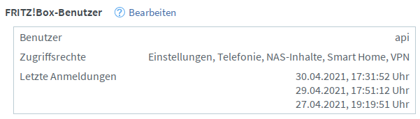

# pfbex

`pfbex` (Prometheus FritzBox Exporter) queries the TR-064 services of a FritzBox
and provides metrics in a format to be processed by [Prometheus]. This exporter
is initially based on the exporter developed by Patrick Dreker.

You can refer to the [changelog](./CHANGELOG.md) for information about the
changes in each version of pfbex.

## Getting Started

The preferred way is to run `pfbex` as a Docker container.

First you need to create an environment file `user.env` containing the settings
for running the exporter. At least you need to provide the username and password
of the user to log in to the FritzBox:

```
FRITZ_USER=api
FRITZ_PASS=api123api
```

If you do not yet have set up a user in the FritzBox, open the web interface by
navigating to http://fritz.box, select `Diagnose` and then `Sicherheit`. Scroll
down on this page to `Fritz!Box Benutzer` and click `Bearbeiten`:



Now you can start the container with `docker-compose up --build`. To run it in
background, use `docker-compose up --build -d`.

To check if the container is up and running correctly, you can use a web browser
to open http://localhost:8765/metrics.

Now you can configure Prometheus to scrape data from the exporter and
e.g. use [Grafana] to show it in a dashboard.

## Settings

All settings are specified as environment variables passed into the docker
container. The easiest way is to create a `user.env` file, which is
automatically read by `docker-compose`.

The following settings are required:

- `FRITZ_USER` and `FRITZ_PASS`: The username and password to log in to query
  diagnostic data from the FritzBox. These two settings are required. All
  following settings are optional.

The following settings are optional:

- `FRITZ_HOST`: The hostname or IP address of the FritzBox. Default:
  `fritz.box`.

- `CACHE_TIME`: Time in seconds, how long diagnostic data is cached before
  querying the FritzBox again. Default: `30`.

- `HTTP_PORT`: The port where `pfbex` is providing the Prometheus metrics
  data. If you change this, you also need to change the port number in the
  docker-compose file. Default: 8765.

- `LOGLEVEL`: Verbosity of the log output. You can use any log level supported
  by Python, e.g. `error`, `warning`, `info` or `debug`. Default: `info`.

- `METRICS_PATH`: Directory where the YAML configuration files are
  stored. Default: `./conf`.


## Supported FritzBox Models

The exporter is tested against a FritzBox 6591 Cable with firmware version
7.22. Currently I do not yet know how much about how the API differs between
FritzBox models and firmware versions.

You can check the `Configuration` section to learn how to extend `pfbex` to add
support for further FritzBox models or versions.

## Development

Contributions in any form are very welcome. Feel free to create issues on github
with feedback and suggestions for improvement and pull requests to improve and
extend the implementation.

## Configuration

All diagnostic values provided by `pfbex` are defined in configuration files in
the `conf` directory. You can add additional metrics by editing these
files. Check [configuration](./docs/configuration.md) for detailed information.

If you find additional data provided by any FritzBox model, it would be nice if
you can share this information, either by creating a pull request or by creating
an issue on Github.

[Prometheus]: https://www.prometheus.io
[Grafana]: https://www.grafana.com
